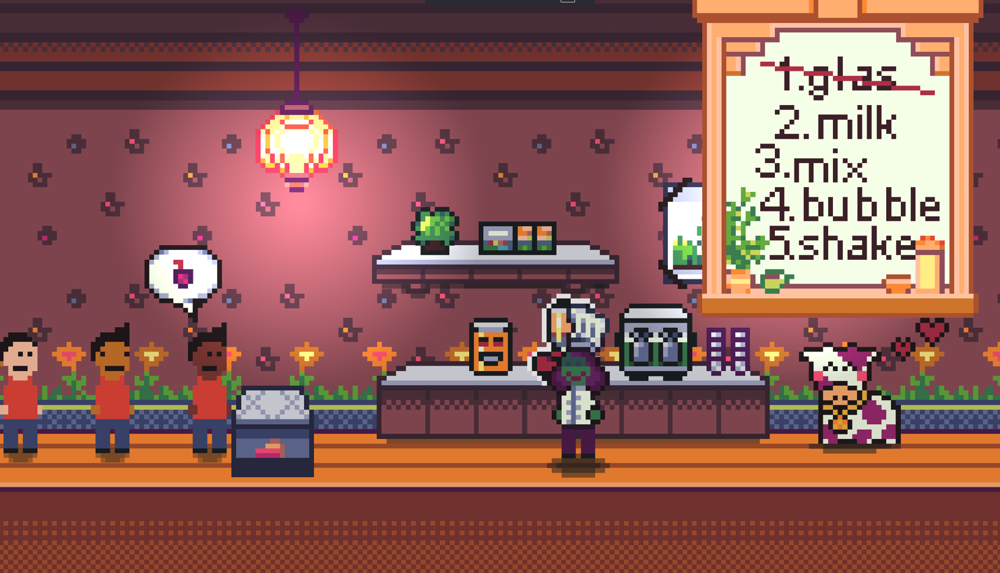

<h1 align="center">
    
</h1>

  <i align="center">This is my Submission for the <a href="https://globalgamejam.org/jam-sites/2025/ggj-kiel-powered-ifgamesh-ev"><b>Global Game Jam 2025</b></a></i>

    

  

## About this Game

This project was created during the **Global Game Jam 2025**.  
The Global Game Jam is a worldwide event where participants design and build a game — digital or analog — in just 48 hours.  

At the start of the jam, a secret theme is revealed which serves as the creative foundation. In 2025, the theme was **"Bubbles"**. From brainstorming ideas and designing the world to programming the core mechanics, the challenge is to turn concepts into a playable experience within a very short time.  

Unlike most teams, I worked on this project **solo**. It was a challenging but rewarding experience to take on all aspects of development — from concept to code — on my own. The focus was not on competition, but on experimenting, learning, and having fun while creating something unique.  

👉 Learn more about the event:  
- [Global Game Jam Kiel 2025](https://globalgamejam.org/jam-sites/2025/ggj-kiel-powered-ifgamesh-ev)  
- [Discord Community](https://discord.com/invite/XMuf4tf)  
